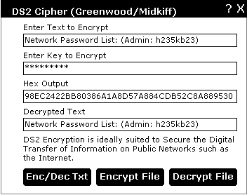



## DS2 Encryption \(Midkiff/Greenwoodf\)

### Description

DS2 Encryption is ideally suited to secure the digital transfer of information on public

networks such as the Internet. The DS2 salt technique can theoretically output 1,078,203,909,375 different encrypted byte streams from just one input stream. Therefore even if the same data is transmitted again it will not look the same. Along with slick clean math function this cipher is fast and secure. From analysis, certain forms of differential attacks may be successful on lesser round variants of this algorithm but nothing is certain. The key-size is variable length and is undeterminable from analysis. Meaning very large keys can be achieved!

SALT TECHNIQUES USED:

This is achieved by selecting 5 random bytes and adding them to the byte stream. The byte stream then undergoes CBC (Cipher Block Chaining), byte & bit level processing before being spit out as 1 of the 1,078,203,909,375 different possible ciphertext results.
 
### More Info
 

             |
---                |---
**Submitted On**   |2001-12-16 20:54:44
**By**             |[Dave Greenwood](https://github.com/Planet-Source-Code/PSCIndex/blob/master/ByAuthor/dave-greenwood.md)
**Level**          |Advanced
**User Rating**    |5.0 (30 globes from 6 users)
**Compatibility**  |VB 5\.0, VB 6\.0
**Category**       |[Encryption](https://github.com/Planet-Source-Code/PSCIndex/blob/master/ByCategory/encryption__1-48.md)
**World**          |[Visual Basic](https://github.com/Planet-Source-Code/PSCIndex/blob/master/ByWorld/visual-basic.md)
**Archive File**   |[DS2\_Encryp4270212172001\.zip](https://github.com/Planet-Source-Code/dave-greenwood-ds2-encryption-midkiff-greenwoodf__1-29892/archive/master.zip)

